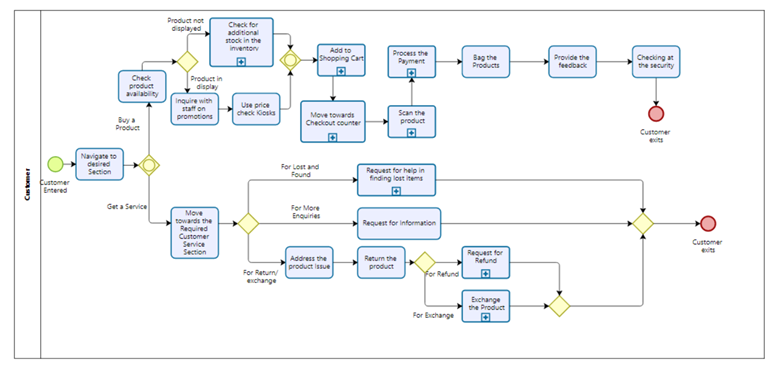
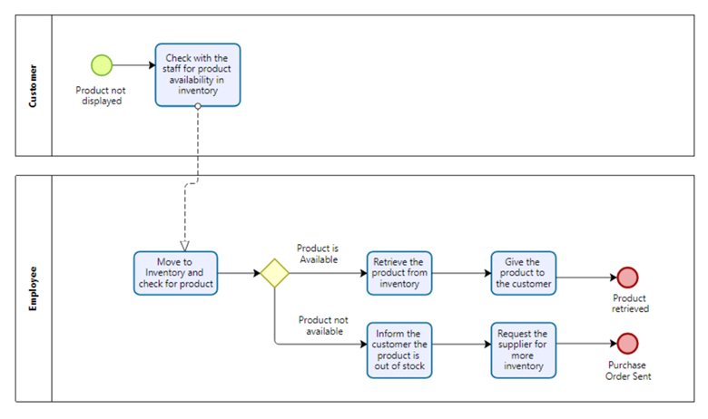
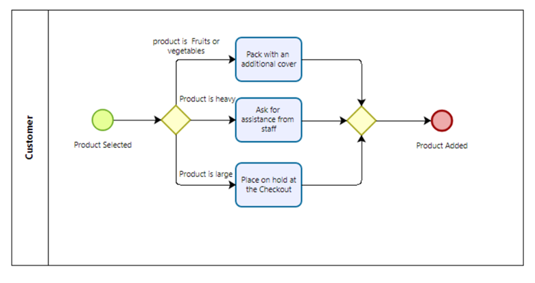
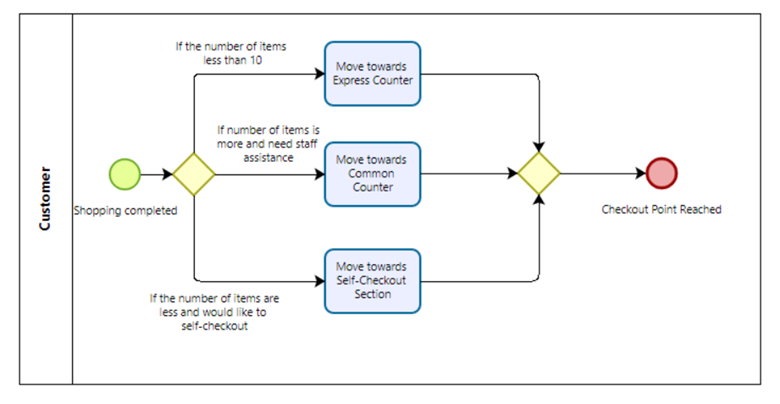
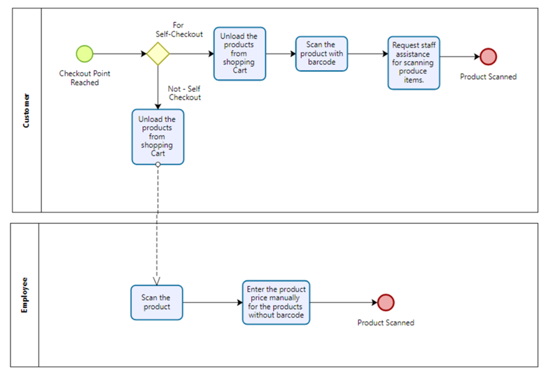
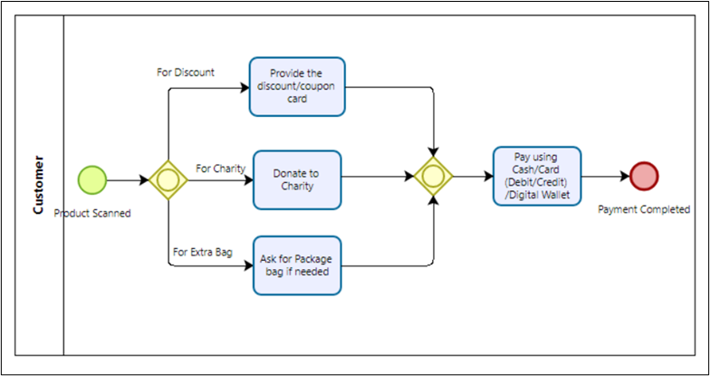
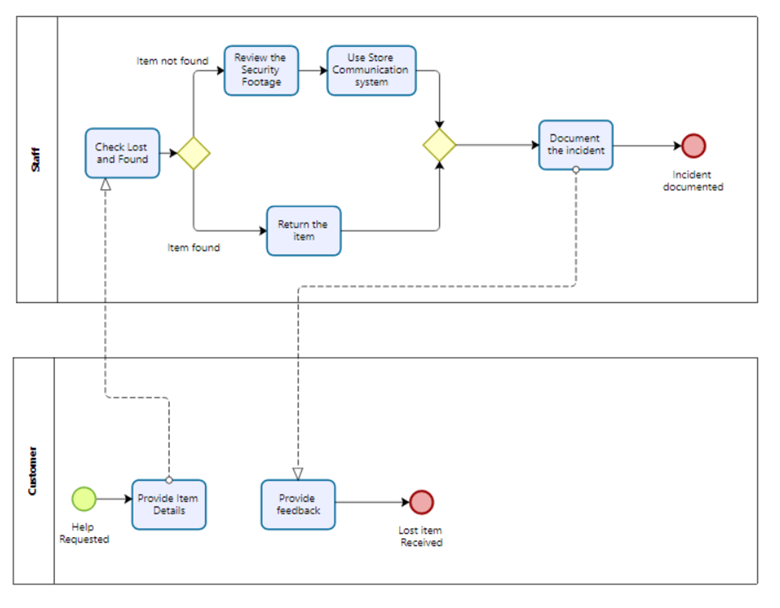
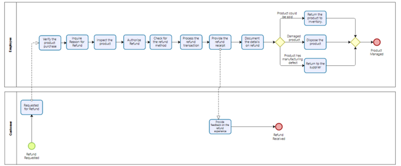
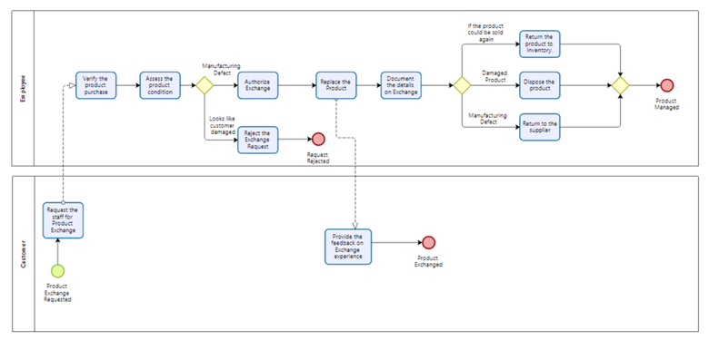

# Case Study: Customer Journey & Operational Optimization for ShopRight Grocery

## Introduction

This case study provides a comprehensive analysis of ShopRight’s in-store customer journey and operational processes. Using advanced BPMN 2.0 process mapping, field research on competitor practices, business metric design, and strategic recommendations, it demonstrates actionable opportunities to enhance customer satisfaction, operational efficiency, and overall market competitiveness.

---

## 1. Customer Journey Process Mapping

The following BPMN 2.0 process maps outline the end-to-end in-store shopping experience at ShopRight, including key subprocesses and customer service scenarios.

### High-Level Journey

- Entry and navigation to product sections
- Product selection and availability checks
- Cart management and movement to checkout
- Scanning and payment
- Bagging, feedback, and exit

### Detailed Subprocesses

- **Check for Additional Stock in Inventory**: Process for items not displayed on shelves, involving staff support and backroom checks.
- **Add to Shopping Cart**: Handling large, heavy, or delicate items and providing assistance.
- **Move to Checkout Counter**: Decision flows for express, regular, or self-checkout lanes.
- **Scan the Product**: Barcode scanning and manual price entry, including staff assistance for produce items.
- **Process Payment**: Handling discounts, donations, bag requests, and payment methods.
- **Request Assistance for Lost Items**: Lost & found workflows including security checks.
- **Request for Refund**: Steps and verifications for product refunds.
- **Exchange Product**: Assessment and processing of product exchanges.

> **Visual Appendix**: All diagrams are included below for reference.

| Figure | Description                              | Image                                                    |
|----------|------------------------------------------|-----------------------------------------------------------|
| 1      | Customer Journey Overview                 |        |
| 2      | Check for Additional Stock                |  |
| 3      | Add to Shopping Cart                      |            |
| 4      | Move to Checkout                          |       |
| 5      | Scan the Product                          |           |
| 6      | Process Payment                           |        |
| 7      | Request Lost Item Assistance             |     |
| 8      | Request for Refund                        |         |
| 9      | Exchange Product                          |       |

---

## 2. Competitive Benchmarking: Field Insights

### Costco (Mississauga)

- Electric carts for seniors and mobility-challenged customers
- One-stop shopping model (medical, tire services, hearing aids, mobile accessories)

### No Frills (Brampton)

- Plastic bag options for leafy produce
- Strong focus on low-cost essentials

### Walmart (Mississauga)

- Extensive self-checkout availability
- In-store food take-out franchises
- Emphasis on promotions and gift cards

### FreshCo (Oakville)

- Price matching and “lowest price” guarantees
- Simple, value-driven assortment

---

## 3. Key Business Metrics

### Outcome-Based Metrics

- **Customer Satisfaction Scores**: Surveys and feedback on experience, staff interactions, cleanliness, and checkout efficiency.
- **Revenue from Sales**: Tracking trends to evaluate marketing and operational performance.
- **Return/Exchange Rate**: Monitor to identify product or service issues.
- **Net Promoter Score (NPS)**: Measure referral likelihood and loyalty.
- **Market Share**: Assess competitive positioning.

### Process-Based Metrics

- **Average Checkout Time**: Identify and reduce bottlenecks.
- **Inventory Turnover Rate**: Enhance freshness, reduce holding costs.
- **Staff Productivity (Items Scanned/Hour)**: Improve efficiency at checkout.
- **Customer Wait Time**: Optimize staffing and queue management.
- **Employee Turnover Rate**: Support retention for consistent service.

---

## 4. Competitive Analysis Matrix

| Metric             | ShopRight          | No Frills         | Walmart         | Costco          | FreshCo         |
|-------------------|---------------------|------------------|-----------------|----------------|----------------|
| Inventory         | Limited in-store checking | Similar    | Strong integration | Bulk-based      | Efficient      |
| Customer Service | Strong, but no dedicated desk | Adequate | Dedicated desks | High staff ratio | Varies        |
| Product Selection| Limited essentials  | Similar         | Extensive       | Bulk-focused    | Affordable mix|
| Returns/Exchanges| Low, policy-driven  | Low, stricter   | Moderate, flexible | Low           | Moderate      |
| Pricing & Discounts | Occasional promos | Low prices     | Frequent promos | Bulk pricing   | Value pricing|
| Feedback Mechanisms| Limited            | Extensive      | Extensive      | Extensive     | Extensive    |
| Staff Ratio      | Higher, bulk handling | Adequate     | Flexible staffing | Higher        | Lower        |
| Availability     | Occasional stockouts| Frequent restock | Moderate      | High         | High         |
| Waste Reduction | Limited             | Plastic/donation focus | Recycling & donations | Bulk-based | Eco packaging|
| Supplier Performance| Variable       | Strong         | Strong        | Strong       | Moderate     |
| Market Share    | Varies locally      | Dominant      | High national | Niche leader| Strong      |
| Sales Revenue   | Lower               | High         | Highest      | High       | Moderate    |

---

## 5. Strategic Recommendations

### Invest in Technology

- Equip staff with handheld devices for real-time inventory and support.
- Implement advanced inventory tracking to reduce stockouts.
- Strengthen digital loyalty and app-based promotions for personalized offers.

### Optimize Checkout Experience

- Enhance self-checkout usability with staff assistance.
- Ensure proactive maintenance and smooth operations.

### Deploy IoT-Based Food Safety

- Use IoT sensors for real-time freshness monitoring.
- Empower staff to act on data-driven alerts.

### Streamline Operations

- Implement preventive maintenance and routine audits.
- Enhance hygiene and cleanliness standards across stores.

### Enhance Delivery Services

- Improve online ordering systems and transparent communication on deliveries.

### Leverage Customer Feedback

- Strengthen multi-channel feedback mechanisms and respond proactively.

### Strengthen Cross-Branch Inventory Visibility

- Enable system-wide stock tracking and seamless inter-branch fulfillment.

---

## Conclusion

Through advanced process mapping, competitive benchmarking, and data-driven strategy, this analysis provides ShopRight with a clear, actionable roadmap to improve customer experience, operational excellence, and market positioning. With these initiatives, ShopRight can strengthen its leadership in the grocery retail sector while fostering long-term loyalty and growth.

---

**Prepared by**  
Kadeejath Niloufer Banu Eriyal Majeed  
Business Analysis & Process Management Specialist
